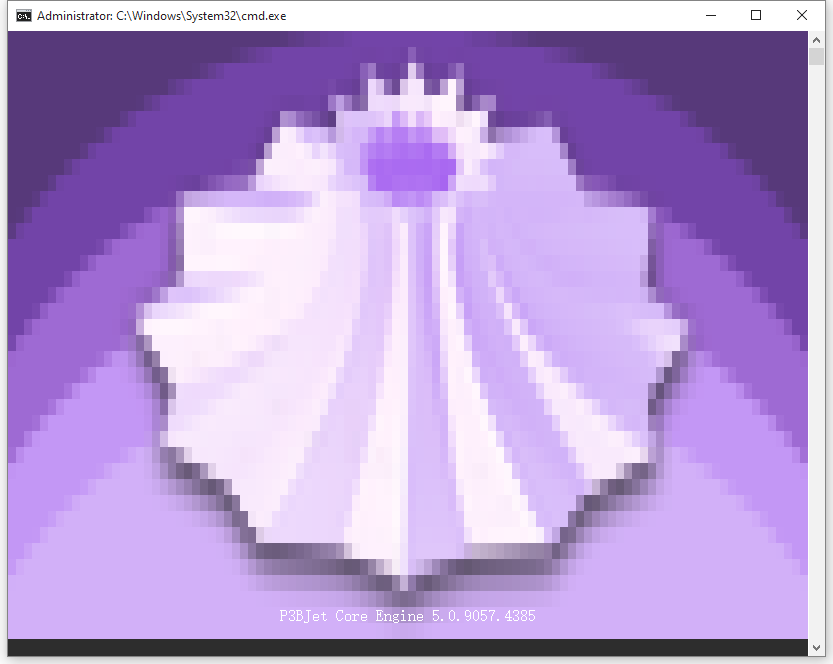
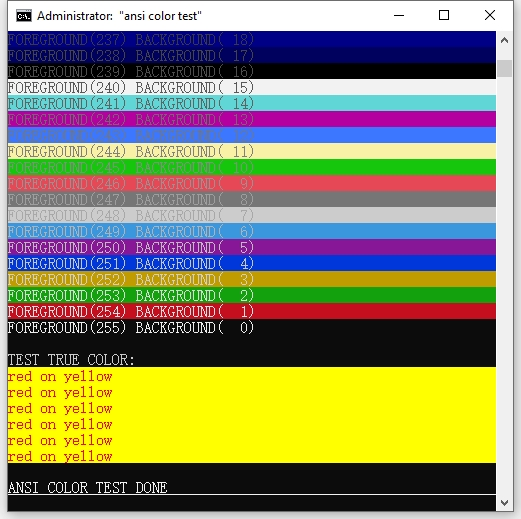

# ANSI Color Output Toolkit


[](https://en.cppreference.com/w/cpp/20)
[]()
[](./LICENSE)

**ANSI Color Output Toolkit** is a lightweight, header‑only C++20 library that provides intuitive and compile‑time safe utilities for rendering colored text in terminal environments using ANSI escape sequences. It supports **standard 8‑color**, **extended 256‑color**, and **true 24‑bit RGB** output, with clean abstractions for foreground/background control, stream integration, and cross‑platform compatibility.

Designed for developers who demand **precision and minimalism**, the toolkit enables expressive color formatting in `std::cout` / `std::cerr` without runtime overhead. With its **compile‑time ANSI generation**, **user‑defined RGB literals** (e.g. `"#FF0000"_fg`), and seamless **`std::format` integration**, it delivers both performance and clarity.  

Whether you are building CLI tools, logging systems, or terminal UIs, **ANSI Color Output Toolkit** gives you full control over how your text looks—while staying lightweight, future‑proof, and dependency‑free.


---

## ✨ Features

- **Compile‑time ANSI generation** for maximum efficiency  
- **User‑defined literals** for RGB colors (e.g. `"#FF0000"_fg`)  
- **Full style support**: bold, italic, underline, blink, reverse, hidden, strike, reset  
- **Cross‑platform compatibility**, with automatic Windows console enabling  
- **TTY‑aware emission policies** (`force`, `never`, `auto`) for precise output control  
- **`std::format` integration**, allowing ANSI objects to be formatted directly with mode specifiers  
- **Header‑only, zero‑dependency design**, requiring only C++20 or later  

---

## 🔧 Terminal Output Preview

Here's what the color output looks like:




## 📦 Example

This is a header-only library. Just drop `ansi_color.hpp` into your project:

```cpp
#include "ansi_color.hpp"

int main(int argc, char* argv[]) {
	using namespace ansi_color;
	enable_windows_ansi();

	std::cout << osc::Title("ANSI COLOR TEST TITLE @ COMPILE-TIME") << std::endl;

	std::cout << "TEST COLOR4:\n";
	std::cout << fg4::red << bg4::bright_yellow << "red on bright_yellow" << reset << std::endl; 
	std::cout << std::endl;

	std::cout << "TEST COLOR8 (256-color palette):\n";
	for (int i = 0; i <= 255; i++)
	{
		std::cout << osc::Title(std::format("ANSI COLOR TEST TITLE @ RUMTIME {}", i));
		std::cout << fg8(i) << bg8::at(255-i) << std::format("FOREGROUND({:3d}) BACKGROUND({:3d})", i, 255-i) << reset << std::endl;
	}
	std::cout << std::endl;

	std::cout << "TEST TRUE COLOR:\n";
	std::cout << "   COMPILE-TIME:\n";
	std::cout << fg24("#F00") << bg24("#ff0") << "red on yellow" << reset << std::endl;
	std::cout << fg24("#FF0000") << bg24("#ffFF00") << "red on yellow" << reset << std::endl;
	std::cout << "#FFff00"_bg << "#FF0000"_fg << "red on yellow" << reset << std::endl;
	constexpr auto fg_red = fg24(255, 0, 0); // 强制编译期
	constexpr auto bg_yellow = bg24(255, 255, 0);
	std::cout << fg_red << bg_yellow << "red on yellow" << reset << std::endl;

	std::cout << "   RUNTIME:\n";
	std::cout << fg24(255, 0, 0) << bg24(255, 255, 0) << "red on yellow" << reset << std::endl;
	std::cout << fg24(std::format("#{:X}{:X}{:X}", 0xF, 0, 0)) << bg24(std::format("#{:X}{:X}{:X}", 0xF, 0xF, 0)) << "red on yellow" << reset << std::endl;

	std::cout << "TEST STD_FORMAT:\n";
	std::cout << std::format("{}{}red on yellow{}", fg4::red, bg4::yellow, reset) << std::endl;
	std::cout << std::format("{}{}red on yellow{}", fg8(1), bg8(11), reset) << std::endl;
	std::cout << std::format("{}{}red on yellow{}", fg24(255, 0, 0), bg24(255, 255, 0), reset) << std::endl;
	std::cout << std::format("{:a}{:a}Automatically detect TTY and output ANSI{:a}", "#FF0000"_fg, "#FFff00"_bg, reset) << std::endl;
	std::cout << std::format("{:n}{:n}Disable ANSI output{:n}", "#FF0000"_fg, "#FFff00"_bg, reset) << std::endl;
	std::cout << std::format("{:f}{:f}Force ANSI sequences into text output (redirected with > out.txt){:f}", "#FF0000"_fg, "#FFff00"_bg, reset) << std::endl; 
	std::cout << std::endl;
	
	std::cout << style::underline << style::bold << "ANSI COLOR TEST DONE" << reset << std::endl;
	std::cout << clear << std::endl;
}
